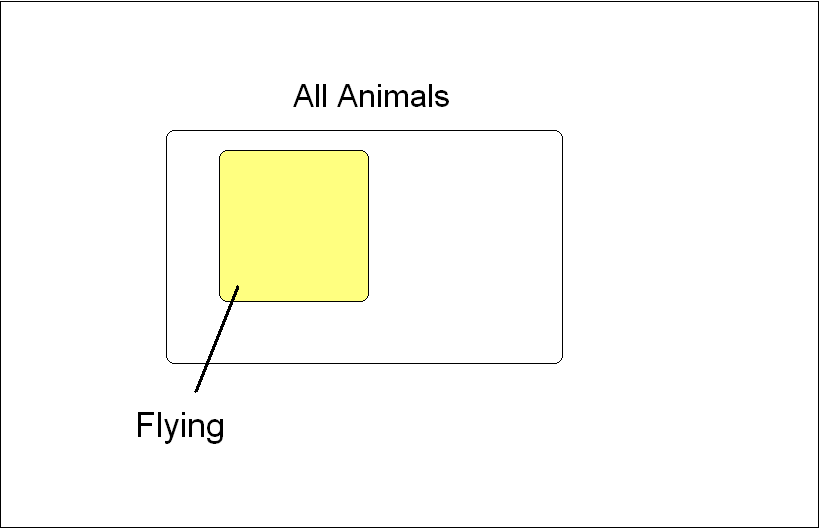
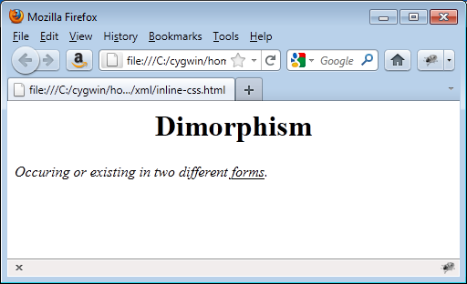
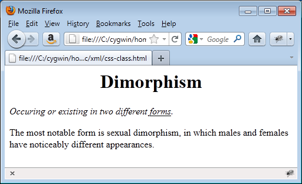

1.  [Booleans](#s:bool)
2.  [The Shell](#s:shell)
3.  [Subversion](#s:svn)
4.  [Python](#s:python)
5.  [Databases](#s:db)
6.  [Cascading Style Sheets](#s:css)

Booleans
--------

Now let's take a look at two words that are adjectives in the real
world, but nouns in programs: `True` and `False`. We'll also look at how
to combine them using `and`, `or`, and `not`, using a few Venn diagrams
that you might remember from grade school.

First, what is truth? Or less poetically, what is true? In Python, the
value `True` is true, but so are the values 1, 3.14, and "cadmium". It's
actually easier to ask what is false, because the list is much shorter:
`False`, zero, the empty string, the empty list, and a handful of things
we haven't met yet. These values are considered false in the way that 0
is considered the same as 0.0: Python automatically uses one as the
other when the context requires it.

Because of this, most Python programmers don't write:

    if len(data) != 0:
        ...do something...

Instead, they just write:

    if len(data):
        ...do something...

Similarly, if we want to do something when the variable `message` holds
an empty string, the idiomatic way to write it is:

    if not message:
        ...do something...

rather than:

    if len(message) == 0:
        ...do something...

### Truth as a Noun

It takes a while to get used to the idea that `True` and `False` are
nouns in programs rather than adjectives. One sign that someone hasn't
really got it is code like this:

    if (x > 0) == True:
        ...do something...

If `x` is greater than zero, then `x > 0` *is* true, so comparing it to
`True` is redundant. Another example is:

    have_data = len(data) > 0
    if have_data == True:
        ...do something...

`len(data)` is either greater than zero or it isn't, so the right side
of the first statement is either true or false. Either value can be
assigned to the variable `have_data` just as easily as a number like 23.
Once again, comparing that value to `True` is redundant—the value *is*
either true or false, so this code should be written:

    have_data = len(data) > 0
    if have_data:
        ...do something...

Now let's consider the set of all animals. This includes dogs, ponies,
monkeys, giraffes, and everything else you loved at the zoo. We can
divide this set of animals by applying some simple Boolean tests. For
example, we could ask, "Is it a flying animal?" Once we've got that set,
we can create the set of all things that *don't* fly by saying, "Not
flying." Those not-flying creatures may not have anything else in common
except the fact that they don't fly, but we don't care. Once we know how
to tell if an animal flies, we can tell if something is not-flying.

For example, [Figure XXX](#f:flying_creatures) shows seven creatures.
Once we've selected the ones that fly, we can say "not flying" to create
the complementary set.

We can divide up those animals in other ways. For example, if we ask
which ones are real and which are not, we get two different subsets from
the same universal set ([Figure XXX](#f:real_creatures)).

In Venn diagram terms, asking which creatures fly divides the world into
two parts: flying and not-flying. Asking which creatures are real also
divides the world into two parts, so our result has four parts ([Figure
XXX](#f:flying_real_creatures)): those that fly, those that are real,
those that satisfy both conditions, and those that satisfy neither. When
a computer programmer says "flying and real", what she means is, "Those
things that satisfy both conditions."

Another way to look at this is to use a table:

  Name      Flying?   Real?
  --------- --------- -------
  owl       true      true
  dragon    true      false
  frog      false     true
  dodo      false     true
  unicorn   false     false
  gazelle   false     true
  mammoth   false     true

Here, we're showing those creatures for which flying is true and for
which flying is false. In another column, we show the true and false
results for the test "is real". If we now say, "flying and real", what
we mean is, "Those creatures that have true in both columns":

  Name      Flying?   Real?   Flying and Real?
  --------- --------- ------- ------------------
  owl       true      true    true
  dragon    true      false   false
  frog      false     true    false
  dodo      false     true    false
  unicorn   false     false   false
  gazelle   false     true    false
  mammoth   false     true    false

A different question to ask of this data is, "Which are the creatures
for which either test is true?" I.e., there's a "true" in one column or
the other, or in both:

  Name      Flying?   Real?   Flying and Real?   Flying or Real?
  --------- --------- ------- ------------------ -----------------
  owl       true      true    true               true
  dragon    true      false   false              true
  frog      false     true    false              true
  dodo      false     true    false              true
  unicorn   false     false   false              false
  gazelle   false     true    false              true
  mammoth   false     true    false              true

If we go back to programming, this is what we mean when we say "flying
or real". The phrase "or both" turns out to be fairly important. When a
human being says "flying or real", sometimes they mean, "Flying or real
but *not* both." (For example, if I ask my daughter, "Would you like
cookies or ice cream for dessert?" I am definitely *not* including both
as an option.)

To a computer scientist, "one or the other but not both" is an
[exclusive or](glossary.html#exclusive-or), because it excludes the
overlap. Almost all of the time, when we're writing programs and we use
"or", it is an [inclusive or](glossary.html#inclusive-or): either
condition, or both, can be true.

We can combine combinations of "and", "or", and "not" to create more
complicated conditions. For example, suppose we want to find creatures
that can fly but aren't real. The first step is to find the ones that
are not real by inverting the values in the "real" column. Then we look
to see which creatures have "true" in both the "flying" and "not real"
columns, and all we're left with are dragons:

  Name      Flying?   Real?   Not Real?   Flying and not Real?
  --------- --------- ------- ----------- ----------------------
  owl       true      true    false       false
  dragon    true      false   true        true
  frog      false     true    false       false
  dodo      false     true    false       false
  unicorn   false     false   true        false
  gazelle   false     true    false       false
  mammoth   false     true    false       false

[Figure XXX](#f:boolean_binding) shows why it's important to be clear
what we mean when we're combining conditions. At the top we have the
creatures that satisfy the condition "(not flying) and real". At the
bottom we have the creatures that satisfy the condition "not (flying and
real)". When you say these two phrases aloud they sound exactly the
same, but as you can see, in one case we have frog, dodo, gazelle, and
mammoth, which are things that don't fly, but are real. In the second
case we have everything that isn't an owl, because it is the only
creatures that flies and is real.

There's one more important sense in which we have to deal with
ambiguity. Suppose we were to create a condition "extinct". It's
obviously false (at least for now) for owls, frogs, and gazelles. It's
true (until cloning works) for dodos and mammoths. But what's the value
for dragons and unicorns? You could say they're extinct because none of
them exist, but the question, "In what year did unicorns become
extinct?" doesn't actually mean anything. Boolean tests in programs will
only be as clear as our understanding of what our data means.

Boolean expressions using `and` and `or` are evaluated differently from
most Python expressions. If we write `3*5 + 2*7`, we don't care whether
`3*5` or `2*7` is evaluated first: the final answer will be the same, so
Python is free to do calculations in whatever order it wants.

Boolean expressions, on the other hand, are always evaluated from left
to right, and their result is the last value they actually examined. For
example, consider the expression:

    number and 1/number

If `number` is zero, Python stops without trying to calculate
`1/number`, because 0 and anything is false. If `number` isn't zero,
though, Python has to keep evaluating in order to find out whether the
`and` expression is true or not, so it calculates `1/number` and uses
that as the expression's final value. This means that we can write:

    reciprocal_or_zero = number and 1/number

and then congratulate ourselves for being very clever. Similarly, if we
want to make sure that `message` doesn't contain an empty string, we can
do something like this:

    message = message or "some default string"

If `message` isn't an empty string, it is considered true, so Python
doesn't evaluate the second part of the `or`: it just assigns
`message`'s value back to itself. If `message` is initially an empty
string (which is considered false), Python has to evaluate the second
part of the `or` to find out whether the whole expression is true or
false. The result of the evaluation is that second value—the default
string—so that's what is assigned to `message`.

Don't do this. It *is* clever, and it can save a line or two of code,
but even experienced programmers mis-read expressions like this more
often than the savings justify. In the second case, it is much clearer
to write:

    if message == "":
        message = "some default string"

or even:

    if not message:
        message = "some default string"

In the first case, where we are trying to prevent division by zero, the
odds are that we have just delayed the crash. If we trying to calculate
the reciprocal of something that might be zero, our algorithm is either
broken or numerically unstable. (After all, the "reciprocal" of zero is
infinity, not zero.) If we create a value that is either meaningful or
zero, we will have to handle both cases in all of our subsequent code.
Sooner or later we will either forget to, or the instability we were
trying to cover up will resurface.

One of the cardinal rules of programming is, "Crash early, crash often."
If something is wrong in a program, we want that program to fail as
quickly as possible, because the more time that goes by between the
error occurring and its effects becoming visible, the harder it will be
to debug. Giving a variable a default value if the user hasn't provided
one is probably a safe and sensible thing to do; pretending that 1/0 is
0 is almost certainly not.

While Loops
-----------

With Booleans in hand, we can now look at Python's other kind of loop:
the [while loop](glossary.html#while-loop). Here's a simple-minded
example:

~~~~ {src="python/simple_while.py"}
number = 0
while number < 3:
    print number
    number += 1
0
1
2
~~~~

[Figure XXX](#f:while_loop) shows how Python executes this loop. At the
start, it tests the condition `number < 3`; since it's true, it runs the
commands in the body of the loop, the second of which changes the value
of of `number` to 1. Python then tests the condition again; since it's
true again, the loop body is re-run, and so on until `number` becomes 3,
at which point the test fails and the loop ends.

It's important to realize that the condition is only tested at the top
of the loop. If we change the order of the lines in the loop body:

    number = 0
    while number < 3:
        number += 1
        print number
    1
    2
    3

the loop now prints 1, 2, and 3 instead of 0, 1, and 2. It doesn't halt
as soon as `number` becomes 3.

It's also important to realize that if we don't change the value of
`number`, this loop will run forever (or until we get bored and kill our
program):

    number = 0
    while number < 3:
        print number
    0
    1
    2
    3
    4
    5
    ...

This is called an [infinite loop](glossary.html#infinite-loop). From
outside a program, it can be hard to tell the difference between a
computation that's taking a long time, and one that's never going to
finish, which is why things like progress bars were invented.

The Shell
---------

  --------------- --------------------------------------------------------------------------
  `cd`            change working directory
  `cp`            copy a file
  `head`          select the first N lines of input
  `ls`            listing
  `-a`            show names beginning with '.'
  `-F`            add '/' to directory names and '\*' to executables
  `-t`            order by time (most recent first)
  `mkdir`         make a directory
  `mv`            move (rename) a file or directory
  `nano`          run a very simple text editor
  `pwd`           print working directory
  `rm`            remove (delete) a file
  `rmdir`         remove (delete) an empty directory
  `-f`            force deletion even if the directory isn't empty
  `sort`          sort lines
  `-n`            sort numerically
  `-r`            reverse sorting order
  `tail`          select the last N lines of output
  `wc`            count words (and lines and characters)
  `<`             send to standard input
  `>`             send to standard output
  `|`             pipe the standard output of one process to the standard input of another
  `*`             match zero or more characters
  `?`             match exactly one character
  `$#`            the number of command-line arguments given to a shell script
  `$*`            all of the command-line arguments given to a shell script
  `$1`, `$2`, …   particular command-line arguments given to a shell script
  --------------- --------------------------------------------------------------------------

Subversion
----------

Write reference guide for Subversion

Python
------

Write reference guide for Python

Databases
---------

Write reference guide for databases

Styling Pages
-------------

We said [earlier](#p:hide-paragraph) that the right way to hide content
in a page was to change the paragraph's style to make it invisible,
rather than commenting it out. This is actually a bit of a hack: the
right way to manage invisibility, or any other aspect of a web page's
visual appearance, is to use [Cascading Style Sheets](glossary.html#css)
(CSS). These allow us change almost every aspect of display, from fonts
and colors to indentation and flow.

Here's a very simple example:

~~~~ {src="web/inline_css.html"}
<html>
  <head>
    
  </head>
  <body>
    <h1>Dimorphism</h1>
    
Occurring or existing in two different <u>forms</u>.

  </body>
</html>
~~~~

Inside the page's `head` element, we have put a `style` element whose
`type` attribute has the value `text/css`. This tells the browser to
apply the style definitions in that element to the contents of the web
page.

The first entry in the CSS states that the text of `h1` heading elements
should be centered, while the second states that the text in paragraph
elements should be italicized. Looking at the screenshot in [Figure
XXX](#f:inline_css), we can see that the underlined element inside the
paragraph is also italicized. This happens because styling applied to
outer elements is inherited by inner elements unless it is explicitly
overridden.

What if we want to change the styles of some paragraphs but not others?
The CSS solution is to define a `class` attribute for those elements,
and to set styles based on that:

~~~~ {src="web/css_class.html"}
<html>
  <head>
    
  </head>
  <body>
    <h1>Dimorphism</h1>
    
Occurring or existing in two different <u>forms</u>.

    

      The most notable form is sexual dimorphism,
      in which males and females have noticeably different appearances.
    

  </body>
</html>
~~~~

The CSS expression `p.definition` specifies that the style applies to
paragraphs whose `class` is `definition`. The first paragraph has this
class, so it is italicized. The second doesn't have a `class` at all, so
it isn't.

There are two reasons why we should use CSS to style elements instead of
applying styles directly. The first is that, as we have said before,
anything repeated in two or more places will eventually be wrong in at
least one. If we want to change how all of our headings are displayed,
it isn't just easier to change one definition in a CSS file—it's more
reliable as well. It also aids display on different devices: if the user
is looking at a cellphone or heads-up display, we will probably want to
style the page differently than if it is a full-screen device.

Second, using CSS is another example of model/view separation. Computer
programs (usually) don't care how something looks, since they can't
actually "see" web pages. The more we separate styling from content, the
easier it is for programs to concentrate on the latter.
