1.  [What and Why](#s:what)
2.  [Files and Directories](#s:filedir)
3.  [Creating Things](#s:create)
4.  [Pipes, Filters, and Wildcards](#s:pipefilter)
5.  [Loops](#s:loop)
6.  [Shell Scripts](#s:scripts)
7.  [Finding Things](#s:find)
8.  [Summing Up](#s:summary)

Nelle Nemo, a marine biologist, has just returned from a six-month
survey of the [North Pacific
Gyre](http://en.wikipedia.org/wiki/North_Pacific_Gyre), where she has
been collecting samples of gelatinous marine life from the [Great
Pacific Garbage
Patch](http://en.wikipedia.org/wiki/Great_Pacific_Garbage_Patch). She
has 1520 samples in all, and now needs to:

1.  Run each sample through an assay machine that will measure the
    relative abundance of 300 different proteins. The machine's output
    for a single sample is one file with one line for each protein.
2.  Calculate statistics for each of the proteins separately using a
    program her supervisor wrote called `goostat`.
3.  Compare the statistics for each protein with corresponding
    statistics for each other protein using a program one of the other
    graduate students wrote called `goodiff`.
4.  Write up. Her supervisor would really like her to do this by the end
    of the month so that her paper can appear in an upcoming special
    issue of Aquatic Goo Letters.

It takes about half an hour for the assay machine to process each
sample. The good news is, it only takes two minutes to set each one up.
Since her lab has eight assay machines that she can use in parallel,
this step will "only" take about two weeks.

The bad news is, if she has to run `goostat` and `goodiff` by hand,
she'll have to enter filenames and click "OK" roughly 300^2^ times (300
runs of `goostat`, plus 300×299 runs of `goodiff`). At 30 seconds each,
that's 750 hours, or 18 weeks, of mindless, repetitive, soul-destroying
work. Not only would she miss her paper deadline, the chances of her
getting all 90,000 commands right are approximately zero.

This chapter is about what she should do instead. More specifically,
it's about how she can use a command shell to automate all the
repetitive steps in her processing pipeline, so that her computer can
work 24 hours a day while she catches up on her reading. As a bonus,
once she has put a processing pipeline together, she will be able to use
it again in the future whenever she, or someone else, collects more data
of this kind.

What and Why
------------

### Learning Objectives:

-   Explain using a diagram where the shell lies between the computer,
    the operating system, and the user's programs.
-   Explain when and why command-line interfaces should be used instead
    of graphical interfaces.

At a high level, computers really do four things:

-   run programs;
-   store data;
-   communicate with each other; and
-   interact with us.

They can do the last of these in many different ways. For example, they
can use direct brain-computer links. This technology is still in its
infancy, but I for one look forward to being assimilated as it matures…
Another way is to talk to them. No, *talk to them*, not *dock the pen*.
This technology is also still somewhat immature.

What most of us use for interacting with computers is a WIMP interface:
windows, icons, mice, and pointers. These technologies didn't become
widespread until the 1980s, but their roots go back to Doug Engelbart's
work in the 1960s, which you can see in what has been called "[The
Mother of All
Demos](http://video.google.com/videoplay?docid=-8734787622017763097#)".

Going back even further, the only way to interact with early computers
was to rewire them. But in between, from the 1950s to the 1980s and into
the present day, people used a technology that's based on the
old-fashioned typewriter, and that technology is what we're going to
explore in this lecture.

When I say "typewriter", I actually mean a line printer connected to a
keyboard ([Figure 1](#f:decwriter)). These devices only allowed input
and output of the letters, numbers, and punctuation found on a standard
keyboard, so programming languages and interfaces had to be designed
around that constraint—although if you were clever enough, you could
draw simple pictures using just those characters ([Figure
2](#f:ascii_art)).

                        ,-.             __
                      ,'   `---.___.---'  `.
                    ,'   ,-                 `-._
                  ,'    /                       \
               ,\/     /                        \\
           )`._)>)     |                         \\
           `>,'    _   \                  /       ||
             )      \   |   |            |        |\\
    .   ,   /        \  |    `.          |        | ))
    \`. \`-'          )-|      `.        |        /((
     \ `-`   .`     _/  \ _     )`-.___.--\      /  `'
      `._         ,'     `j`.__/           `.    \
        / ,    ,'         \   /`             \   /
        \__   /           _) (               _) (
          `--'           /____\             /____\

ASCII Art

This kind of interface is called a command-line user interface, or
[CLUI](glossary.html#clui), to distinguish it from the graphical user
interface, or [GUI](glossary.html#gui), that most of us now use. The
heart of a CLUI is a read-evaluate-print loop: when the user types a
command, the computer executes it and prints its output. (In the case of
old teletype terminals, it literally printed the output onto paper, a
line at a time.) The user then types another command, and so on until
the user logs off.

From this description, you'd think that the user was sending commands
directly to the computer, and that the computer was sending output
directly to the user. In fact, there's a program in between called a
[command shell](glossary.html#shell) ([Figure 3](#f:command_shell)).
What the user types goes into the shell; it figures out what commands to
run and orders the computer to execute them. The computer then sends the
output of those programs back to the shell, which takes care of
displaying things to the user.

A shell is just a program like any other. The only thing that's special
about it is that its job is to run other programs, rather than to do
calculations itself. The most popular Unix shell is Bash, the Bourne
Again SHell (so-called because it's derived from a shell written by
Stephen Bourne—this is what passes for wit among programmers). Bash is
the default shell on most modern implementations of Unix, and also comes
with [Cygwin](http://www.cygwin.org), a popular Unix-on-Windows toolkit.

Using Bash, or any other shell, feels more like programming that like
using a mouse. Commands are terse (often only a couple of characters
long), their names are often cryptic, and their only output is lines of
text rather than a graph or diagram. On the other hand, the shell allows
us to combine existing tools in powerful ways with only a few
keystrokes, and to set up pipelines to handle large volumes of data
automatically. In addition, the command line is often the easiest way to
interact with remote machines. As clusters and cloud computing become
more popular for scientific data crunching, being able to drive them is
becoming a necessary skill.

### Summary

-   The shell is a program whose primary purpose is to read commands,
    run programs, and display results.

Files and Directories
---------------------

### Learning Objectives:

-   Explain the similarities and differences between a file and a
    directory.
-   Translate an absolute path into a relative path and vice versa.
-   Construct absolute and relative paths that identify specific files
    and directories.
-   Explain the steps in the shell's read-run-print cycle.
-   Identify the actual command, flags, and filenames in a command-line
    call.
-   Demonstrate the use of tab completion, and explain its advantages.

Some of the shell commands we will use most often are related to storing
data on disk. The subsystem responsible for this is called the [file
system](glossary.html#file-system). It organizes our data into files,
which hold information, and directories, which hold files or other
directories.

To start, let's log in to the computer by typing our user ID and
password. (We'll show user input like this.) Most systems will print
stars to obscure the password, or nothing at all, in case some evildoer
is shoulder surfing behind us.

    login: vlad
    password: ********
    $

Once we have logged in we'll see a [prompt](glossary.html#prompt), which
is the computer's way of telling us that it's waiting for input. This is
usually just a dollar sign, but which may show extra information such as
our user ID. Type `whoami`{.in}, followed by enter. This command prints
out the ID of the current user, i.e., shows us who the shell thinks we
are:

    $ whoami
    vlad
    $

More specifically, when we type `whoami` the shell finds a program
called `whoami`, runs it, displays its output, and then displays a new
prompt to tell us that it's ready for more commands.

Now that we know *who* we are, we can find out *where* we are using
`pwd`, which stands for "print working directory". This is our current
default directory, i.e., the directory (or folder) that the computer
assumes we want to run commands on unless we specify something else
explicitly. Here, the computer's response is `/users/vlad`{.out}, which
is Vlad's [home directory](glossary.html#home-directory):

    $ pwd
    /users/vlad
    $

To understand what this means, let's have a look at how the file system
as a whole is organized ([Figure 4](#f:filesystem)):

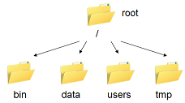

The very top of the file system is a directory called the [root
directory](glossary.html#root-directory) that holds everything else the
computer is storing. When we want to refer to it, we just use a slash
character `/`. This is the leading slash in `/users/vlad`.

Inside that directory (or underneath it, if you're drawing a tree) are
several other directories, such as `bin` (which is where some built-in
programs are stored), `data`, `users` (where users' personal directories
are located), `tmp` (for temporary files that don't need to be stored
long-term), and so on. We know that our current working directory
`/users/vlad` is stored inside `/users` because `/users` is the first
part of its name. Similarly, we know that `/users` is stored inside the
root directory `/` because its name begins with `/`.

Underneath `/users`, we find one directory for each user with an account
on this machine:

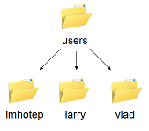

The Mummy's files are stored in `/users/imhotep`, Wolfman's in
`/users/larry`, and ours in `/users/vlad`, which is why `vlad` is the
last part of the directory's name. Notice, by the way, that there are
two meanings for the `/` character. When it appears at the front of a
file or directory name, it refers to the root directory. When it appears
*inside* a name, it's just a separator.

Let's see what's in Vlad's home directory by running `ls`, which stands
for "listing". (It's not a particularly memorable name, but as we'll
see, many others are unfortunately even more cryptic.)

    $ ls
    bin          data      mail       music
    notes.txt    papers    pizza.cfg  solar
    solar.pdf    swc
    $

`ls` prints the names of all the files and directories in the current
directory in alphabetical order, arranged neatly into columns. To make
its output more comprehensible, we can give it the
[flag](glossary.html#command-line-flag) `-F` by typing `ls -F`. This
tells `ls` to add a trailing `/` to the names of directories:

    $ ls -F
    bin/         data/     mail/      music/
    notes.txt    papers/   pizza.cfg  solar/
    solar.pdf    swc/
    $

As you can see, there are seven of these. The names `notes.txt`,
`pizza.cfg`, and `solar.pdf` that don't have trailing slashes are plain
old files.

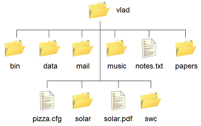

### What's In A Name?

You may have noticed that files' names are all something dot something.
By convention, the second part, called the [filename
extension](glossary.html#filename-extension), indicates what type of
data the file holds: `.txt` signals a plain text file, `.pdf` indicates
a PDF document, `.cfg` is a configuration file full of parameters for
some program or other, and so on. However, this is only a convention,
and not a guarantee. Files contain bytes, nothing more. It's up to us
and our programs to interpret those bytes according to the rules for PDF
documents, images, and so on.

Now let's run the command `ls -F data`, which tells `ls` to give us a
listing of what's in our `data` directory:

    $ ls -F data
    amino_acids.txt   elements/     morse.txt
    pdb/              planets.txt   sunspot.txt
    $

The output shows us that there are four text files and two directories.
This hierarchical organization helps us keep our work organized. Notice
how we spelled the directory name `data`. Since it doesn't begin with a
slash, it's a [relative path](glossary.html#relative-path), i.e., it's
interpreted relative to the current working directory:

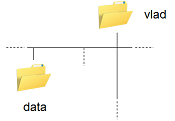

If we run `ls -F /data`, we get a different answer, because `/data` is
an [absolute path](glossary.html#absolute-path):

    $ ls -F /data
    access.log    backup/    hardware.cfg
    network.cfg
    $

The leading `/` tells the computer to follow the path from the root of
the filesystem, so it always refers to exactly one directory, no matter
where we are when we run the command.

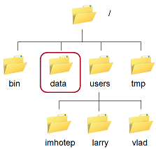

What if we want to change our current working directory? `pwd` shows us
that we're still in `/users/vlad`, and `ls` without any arguments shows
us its contents:

    $ pwd
    /users/vlad
    $ ls
    bin/         data/     mail/      music/
    notes.txt    papers/   pizza.cfg  solar/
    solar.pdf    swc/
    $

We can use `cd` followed by a directory name to change our working
directory. `cd` stands for "change directory", which is a bit
misleading: the command doesn't change the directory, it changes the
shell's idea of what directory we are in.

    $ cd data
    $

`cd` doesn't print anything, but if we run `pwd` after it, we can see
that we are now in `/users/vlad/data`. If we run `ls` without arguments
now, it lists the contents of `/users/vlad/data`, because that's where
we now are:

    $ pwd
    /users/vlad/data
    $ ls
    amino_acids.txt   elements/     morse.txt
    pdb/              planets.txt   sunspot.txt
    $

OK, we can go down the directory tree: how do we go up? If we're still
in `/users/vlad/data`, we can use `cd ..` to go up one level:

    $ pwd
    /users/vlad/data
    $ cd ..

`..` is a special directory name meaning "the directory containing this
one", or, more succinctly, the [parent](glossary.html#parent-directory)
of the current directory. Sure enough, if we run `pwd` after running
`cd ..`, we're back in `/users/vlad`:

    $ pwd
    /users/vlad
    $

The special directory `..` doesn't usually show up when we run `ls`. If
we add the `-a` flag to our `-F`, though, it will be displayed:

    $ ls -F -a
    ./           ../       bin/       data/
    mail/        music/    notes.txt  papers/
    pizza.cfg    solar/    solar.pdf    swc/

`-a` stands for "show all". It forces `ls` to show us directory names
that begin with `.`, such as `..` (which, if we're in `/users/vlad`,
means the `/users` directory). As you can see, it also displays another
special directory that's just called `.`. This means "the directory
we're currently in". It may seem redundant to have a name for it, but
we'll see some uses for it soon.

Everything we have seen so far works on Unix and its descendents, such
as Linux and Mac OS X. Things are a bit different on Windows. A typical
directory path on a Windows 7 machine might be `C:\Users\vlad`. The
first part, `C:`, is a [drive letter](glossary.html#drive-letter) that
identifies which disk we're talking about. This notation dates back to
the days of floppy drives, and even today, each drive is a completely
separate filesystem.

Instead of a forward slash, Windows uses a backslash to separate the
names in a path. This causes headaches because Unix uses backslash to
allow input of special characters. For example, if we want to put a
space in a filename on Unix, we would write the filename as
`my\ results.txt`. Please don't ever do this, though: if you put spaces,
question marks, and other special characters in filenames on Unix, you
can confuse the shell for reasons that we'll see shortly.

Finally, Windows filenames and directory names are [case
insensitive](glossary.html#case-insensitive): upper and lower case
letters mean the same thing. This means that the path name
`C:\Users\vlad` could be spelled `c:\users\VLAD`, `C:\Users\Vlad`, and
so on. Some people argue that this is more natural: after all, "VLAD" in
all upper case and "Vlad" spelled normally refer to the same person.
However, it causes headaches for programmers, and can be difficult for
people to understand if their first language doesn't use a cased
alphabet.

### For Cygwin Users

[Cygwin](http://www.cygwin.org) tries to make Windows paths look more
like Unix paths by allowing us to use a forward slash instead of a
backslash as a separator. It also allows us to refer to the C drive as
`/cygdrive/c/` instead of as `C:`. (The latter usually works too, but
not always.) Paths are still case insensitive, though, which means that
if you try to put files called `backup.txt` (in all lower case) and
`Backup.txt` (with a capital 'B') into the same directory, the second
will overwrite the first.

### Nelle's Pipeline: Organizing Files

Knowing just this much about files and directories, Nelle is ready to
organize the files that the protein assay machine will create. First,
she creates a directory called `north-pacific-gyre` (to remind herself
where the data came from). Inside that, she creates a directory called
`2012-07-03`, which is the date she started processing the samples. She
used to use names like `conference-paper` and `revised-results`, but she
found them hard to understand after a couple of years. (The final straw
was when she found herself creating a directory called
`revised-revised-results-3`.)

Each of her physical samples is labelled according to her lab's
convention with a unique ten-character ID, such as "NENE01729A". This is
what she used in her collection log to record the location, time, depth,
and other characteristics of the sample, so she decides to use it as
part of each data file's name. Since the assay machine's output is plain
text, she will call her files `NENE01729A.txt`, `NENE01812A.txt`, and so
on. All 1520 files will go into the same directory ([Figure
9](#f:pipeline_source_file_layout)).

If she is in her home directory, Nelle can see what files she has using
the command:

    $ ls north-pacific-gyre/2012-07-03/

Since this is a lot to type, she can take advantage of Bash's [command
completion](glossary.html#command-completion). If she types:

    $ ls no

and then presses tab, Bash will automatically complete the directory
name for her:

    $ ls north-pacific-gyre/

If she presses tab again, Bash will add `2012-07-03/` to the command,
since it's the only possible completion. Pressing tab again does
nothing, since there are 1520 possibilities; pressing tab twice brings
up a list of all the files, and so on.

### Summary

-   The file system is responsible for managing information on disk.
-   Information is stored in files, which are stored in directories
    (folders).
-   Directories can also store other directories, which forms a
    directory tree.
-   `/` on its own is the root directory of the whole filesystem.
-   A relative path specifies a location starting from the current
    location.
-   An absolute path specifies a location from the root of the
    filesystem.
-   Directory names in a path are separated with '/' on Unix, but '\\'
    on Windows.
-   '..' means "the directory above the current one"; '.' on its own
    means "the current directory".
-   Most files' names are `something.extension`; the extension isn't
    required, and doesn't guarantee anything, but is normally used to
    indicate the type of data in the file.
-   `cd path` changes the current working directory.
-   `ls path` prints a listing of a specific file or directory; `ls` on
    its own lists the current working directory.
-   `pwd` prints the user's current working directory (current default
    location in the filesystem).
-   `whoami` shows the user's current identity.
-   Most commands take options (flags) which begin with a '-'.

### Challenges

Please refer to [Figure XXX](#f:filedir_challenge) when answering the
challenges below.

1.  If `pwd` displays `/users/thing`, what will `ls ../backup`{.in}
    display?
    1.  `../backup: No such file or directory`{.err}
    2.  `2012-12-01 2013-01-08 2013-01-27`{.out}
    3.  `2012-12-01/ 2013-01-08/ 2013-01-27/`{.out}
    4.  `original pnas_submission pnas_final`{.out}

2.  If `pwd` displays `/users/fly`, what command will display

        thesis/ papers/ articles/

    1.  `ls pwd`{.in}
    2.  `ls -r -F`{.in}
    3.  `ls -r -F /users/fly`{.in}
    4.  Either \#2 or \#3 above, but not \#1.

3.  What does the command `cd`{.in} without a directory name do?
    1.  It has no effect.
    2.  It changes the working directory to `/`.
    3.  It changes the working directory to the user's home directory.
    4.  It is an error.

Creating Things
---------------

### Learning Objectives:

-   Create a directory hierarchy that matches a given diagram.
-   Create files in that hierarchy using an editor or by copying and
    renaming existing files.
-   Display the contents of a directory using the command line.
-   Delete specified files and/or directories.

We now know how to look at files and directories, but how do we create
them in the first place? Let's go back to Vlad's home directory,
`/users/vlad`, and use `ls -F` to see what files and directories it
contains:

    $ pwd
    /users/vlad
    $ ls -F
    bin/         data/     mail/      music/
    notes.txt    papers/   pizza.cfg  solar/
    solar.pdf    swc/
    $

Let's create a new directory called `tmp` using the command `mkdir tmp`
(which has no output):

    $ mkdir tmp
    $

As you might (or might not) guess from its name, `mkdir` means "make
directory". Since `tmp` is a relative path (i.e., doesn't have a leading
slash), the new directory is made below the current one:

    $ ls -F
    bin/         data/     mail/      music/
    notes.txt    papers/   pizza.cfg  solar/
    solar.pdf    swc/      tmp/
    $

However, there's nothing in it yet—`tmp` is empty:

    $ ls -F tmp
    $

Let's change our working directory to `tmp` using `cd`, then run the
command `nano junk`:

    $ cd tmp
    $ nano junk

`nano` is a very simple text editor that only a programmer could really
love. [Figure 10](#f:nano) shows what it looks like when it runs:

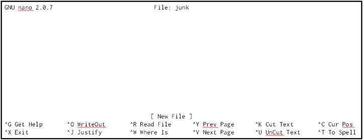

The cursor is the blinking square in the upper left; it shows us where
what we type will be inserted. Let's type in a short quotation:

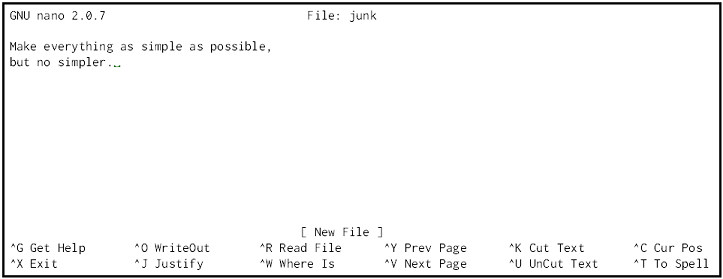

then use Control-O to write our data to disk. (By convention, Unix
documentation uses the caret `^` followed by a letter to mean "control
plus that letter".) Once our quotation is saved, we can use Control-X to
quit the editor and return to the shell.

### Which Editor?

When we say, "`nano` is a text editor," we really do mean "text": it can
only work with plain character data, not tables, images, or any other
human-friendly media. We'll use it in this chapter because almost anyone
can use it anywhere without training, but please use something more
powerful for real work. On Unix systems (such as Linux and Mac OS X),
many programmers use [Emacs](http://www.gnu.org/software/emacs/) and
[Vim](http://www.vim.org/) (neither of which is particularly easy to
learn), or a graphical editor such as
[Gedit](http://projects.gnome.org/gedit/). On Windows, you may wish to
use [Notepad++](http://notepad-plus-plus.org/).

No matter what editor you use, you will need to know where it searches
for and saves files. If you start the editor from a shell, it will
(probably) use your current working directory as its default location.
If you use your computer's start menu, it may want to save files in your
desktop or documents directory instead. You can change this by
navigating to another directory the first time you "Save As..."

`nano` doesn't leave any output on the screen after it exits. But `ls`
now shows that we have created a file called `junk`:

    $ ls
    junk
    $

We can run `ls` with the `-s` flag to show us how big the file we just
created is:

    $ ls -s
       1  junk
    $

Unfortunately, by default Unix reports sizes in disk blocks, which just
might be the least helpful default imaginable. If we add the `-h` flag,
`ls` switches to more human-friendly units:

    $ ls -s -h
     512  junk
    $

Here, 512 is the number of bytes the file takes up. This is more than we
actually typed in because the smallest unit of storage on the disk is
typically a block of 512 bytes.

Let's tidy up by running `rm junk`:

    $ rm junk
    $

This command removes files ("rm" is short for "remove"). If we now run
`ls` again, its output is empty once more, which tells us that our file
is gone:

    $ ls
    $

### Deleting Is Forever

It's important to remember that Unix doesn't have a trash bin: when we
delete files, they are unhooked from the file system so that their
storage space on disk can be recycled. Tools for finding and recovering
deleted files do exist, but there's no guarantee they'll work in any
particular situation, since the computer may recycle the file's disk
space right away.

Let's re-create that file and then move up one directory to
`/users/vlad` using `cd ..`:

    $ pwd
    /users/vlad/tmp
    $ nano junk
    $ ls
    junk
    $ cd ..
    $

If we try to remove the `tmp` directory using `rm tmp`, we get an error
message:

    $ rm tmp
    rm: cannot remove `tmp': Is a directory
    $

This happens because `rm` only works on files, not directories. The
right command is `rmdir`, which is short for "remove directory": It
doesn't work yet either, though, because the directory we're trying to
remove isn't empty:

    $ rmdir tmp
    rmdir: failed to remove `tmp': Directory not empty
    $

(This little safety feature can save you a lot of grief, particularly if
you are a bad typist.) If we want to get rid of `tmp` we must first
delete the file `junk`:

    $ rm tmp/junk
    $

The directory is now empty, so `rmdir` can delete it:

    $ rmdir tmp
    $

Let's create that directory and file one more time. (Note that this time
we're running `nano` with the path `tmp/junk`, rather than going into
the `tmp` directory and running `nano` on `junk` there.)

    $ pwd
    /users/vlad/tmp
    $ mkdir tmp
    $ nano tmp/junk
    $ ls tmp
    junk
    $

`junk` isn't a particularly informative name, so let's change the file's
name using `mv`, which is short for "move":

    $ mv tmp/junk tmp/quotes.txt
    $

The first argument tells `mv` what we're moving, while the second is
where it's to go. In this case, we're moving `tmp/junk` to
`tmp/quotes.txt`, which has the same effect as renaming the file. Sure
enough, `ls` shows us that `tmp` now contains one file called
`quotes.txt`:

    $ ls tmp
    quotes.txt
    $

Just for the sake of inconsistency, `mv` also works on directories—there
is no separate `mvdir` command.

Let's move that file into the current working directory. We use `mv`
once again, but this time, the second argument is the name of a
directory, which is the directory we want that file to put in. In this
case, the special directory name `.` that we [mentioned
earlier](#a:dot-directory)):

    $ mv tmp/quotes.txt .
    $

The effect is to move the file from the directory it was in to the
current directory. `ls` now shows us that `tmp` is now empty, and that
`quotes.txt` is in our current directory. Notice that `ls` with a
filename or directory name as an argument only lists that file or
directory:

    $ ls tmp
    $ ls quotes.txt
    quotes.txt
    $

The `cp` command works very much like `mv`, except it copies a file
instead of moving it. We can check that it did the right thing using
`ls` with two paths as arguments—like many other Unix commands, `ls` can
process thousands of paths at once:

    $ cp quotes.txt tmp/quotations.txt
    $ ls quotes.txt tmp/quotations.txt
    quotes.txt   tmp/quotations.txt
    $

To prove that we made a copy, let's delete the `quotes.txt` file in the
current directory, and then run that same `ls` again. This time, it
tells us that it can't find `quotes.txt` in the current directory, but
it does find the copy in `tmp` that we didn't delete:

    $ ls quotes.txt tmp/quotations.txt
    ls: cannot access quotes.txt: No such file or directory
    tmp/quotations.txt
    $

Let's make one more copy. This time, though, we don't specify the
destination filename, just a directory, so the copy will keep the
original's filename:

    $ cp tmp/quotations.txt .
    $ ls quotations.txt
    quotations.txt
    $

### Alphabet Soup

`mv` probably isn't the first thing that springs to mind when you want
to rename a file. And why is it `cp` instead of plain old `copy`? The
usual answer is that in the early 1970s, when Unix was first being
developed, every keystroke counted: the devices of the day were slow,
and backspacing on a teletype was so painful that cutting the number of
keystrokes in order to cut the number of typing mistakes was actually a
win for usability.

Ever since, people have complained about how cryptic Unix commands are,
and about how hard they are to learn and remember. In 1983, [De Leon and
colleagues](bib.html#deleon-trouble-with-unix) found that while Unix
commands weren't harder for novice users to learn, they were probably
more difficult for them to use. We're stuck with them now, though, just
as we're stuck with the roolz uv Inglish speling.

### Summary

-   Unix documentation uses '\^A' to mean "control-A".
-   The shell does *not* have a trash bin: once something is deleted,
    it's really gone.
-   `mkdir path` creates a new directory.
-   `cp old new` copies a file.
-   `mv old new` moves (renames) a file or directory.
-   `nano` is a very simple text editor—please use something else for
    real work.
-   `rm path` removes (deletes) a file.
-   `rmdir path` removes (deletes) an empty directory.

### Challenges

1.  Suppose that `pwd`{.in} displays `/home/thing/data`{.out}, and that
    `ls`{.in} displays `proteins.dat`{.out}. What does `ls`{.in} display
    after the sequence of commands:

        $ mkdir recombine
        $ mv proteins.dat recombine
        $ cp recombine/proteins.dat ../proteins-saved.dat

    1.  Nothing: `mv proteins.dat recombine`{.in} is an error, because
        `recombine` already exists.
    2.  `recombine`{.out}
    3.  `proteins-saved.dat recombine`{.out}
    4.  `proteins.dat proteins-saved.dat recombine`{.out}

2.  Suppose that `ls -F`{.in} displays:

        analyzed/  fructose.dat    raw/   sucrose.dat

    What command(s) have to be given *before* the commands shown below
    will produce the output shown?

        $ ls
        analyzed   raw
        $ ls analyzed
        fructose.dat    sucrose.dat

    1.  `mv fructose.dat sucrose.dat analyzed`{.in}
    2.  `mv fructose.dat analyzed`{.in} and
        `mv sucrose.dat analyzed`{.in} (in either order)
    3.  `mv fructose.dat analyzed`{.in} and
        `mv sucrose.dat analyzed`{.in} (in either order), and then
        `rm fructose.dat`{.in} and `rm sucrose.dat`{.in} (in either
        order)
    4.  `cp fructose.dat analyzed`{.in} and
        `cp sucrose.dat analyzed`{.in} (in either order), and then
        `rm fructose.dat`{.in} and `rm sucrose.dat`{.in} (in either
        order)
    5.  \#1, \#2, and \#4 above, but not \#3.
    6.  \#2 or \#3 above, but not \#1 or \#4.

Pipes and Filters
-----------------

### Learning Objectives:

-   Write wildcard expressions that select certain subsets of the files
    in one or more directories.
-   Explain when wildcards are expanded.
-   Redirect a command's output to a file.
-   Process a file instead of keyboard input using redirection.
-   Construct command pipelines with two or more stages.
-   Explain what usually happens if a program or pipeline isn't given
    any input to process.
-   Explain the advantages of Unix's "small pieces, loosely joined"
    philosophy.

Now that we know a few basic commands, we can finally look at its most
powerful feature: the ease with which it lets you combine existing
programs in new ways. We'll start with a directory called `molecules`
that contains six files describing some simple organic molecules. The
`.pdb` extension indicates that these files are in Protein Data Bank
format, a simple text format that specifies the type and position of
each atom in the molecule.

    $ ls molecules
    cubane.pdb    ethane.pdb    methane.pdb
    octane.pdb    pentane.pdb   propane.pdb
    $

Let's go into that directory with `cd` and run the command `wc *.pdb`.
`wc` is the "word count" command: it counts the number of lines, words,
and characters in files. The `*` in `*.pdb` matches zero or more
characters, so the shell turns `*.pdb` into a complete list of `.pdb`
files:

    $ cd molecules
    $ wc *.pdb
      20  156 1158 cubane.pdb
      12   84  622 ethane.pdb
       9   57  422 methane.pdb
      30  246 1828 octane.pdb
      21  165 1226 pentane.pdb
      15  111  825 propane.pdb
     107  819 6081 total
    $

### Wildcards

`*` is a [wildcard](glossary.html#wildcard). It matches zero or more
characters, so `*.pdb` matches `ethane.pdb`, `propane.pdb`, and so on.
On the other hand, `p*.pdb` only matches `pentane.pdb` and
`propane.pdb`, because the 'p' at the front only matches itself.

`?` is also a wildcard, but it only matches a single character. This
means that `p?.pdb` matches `pi.pdb` or `p5.pdb`, but not `propane.pdb`.
We can use any number of wildcards at a time: for example, `p*.p?*`
matches anything that starts with a 'p' and ends with '.', 'p', and at
least one more character (since the '?' has to match one character, and
the final '\*' can match any number of characters). Thus, `p*.p?*` would
match `preferred.practice`, and even `p.pi` (since the first '\*' can
match no characters at all), but not `quality.practice` (doesn't start
with 'p') or `preferred.p` (there isn't at least one character after the
'.p').

When the shell sees a wildcard, it expands it to create a list of
filenames *before* passing those names to whatever command is being run
([Figure 12](#f:wildcard_expansion)). This means that commands like `wc`
and `ls` never actually see the wildcards: all they see are what those
wildcards matched.

If we run `wc -l` instead of just `wc`, the output shows only the number
of lines per file:

    $ wc -l *.pdb
      20  cubane.pdb
      12  ethane.pdb
       9  methane.pdb
      30  octane.pdb
      21  pentane.pdb
      15  propane.pdb
     107  total
    $

We can use `-w` to get only the number of words, or `-c` to get only the
number of characters.

Now, which of these files is shortest? It's an easy question to answer
when there are only six files, but what if there were 6000? That's the
kind of job we want a computer to do.

Our first step toward a solution is to run the command:

    $ wc -l *.pdb > lengths

The `>` tells the shell to [redirect](glossary.html#redirection) the
command's output to a file instead of printing it to the screen. The
shell will create the file if it doesn't exist, or overwrite the
contents of that file if it does:

    $ wc -l *.pdb > lengths
    $

Notice that there is no screen output: everything that `wc` would have
printed has gone into the file `lengths` instead. `ls lengths` confirms
that the file exists:

    $ ls lengths
    lengths
    $

We can print the content of `lengths` to the screen using `cat lengths`.
`cat` stands for "concatenate": it prints the contents of files one
after another. In this case, there's only one file, so `cat` just shows
us what's in it:

    $ cat lengths
      20  cubane.pdb
      12  ethane.pdb
       9  methane.pdb
      30  octane.pdb
      21  pentane.pdb
      15  propane.pdb
     107  total
    $

Now let's use the `sort` command to sort its contents. This does *not*
change the file. Instead, it prints the sorted result to the screen:

    $ sort lengths
      9  methane.pdb
     12  ethane.pdb
     15  propane.pdb
     20  cubane.pdb
     21  pentane.pdb
     30  octane.pdb
    107  total
    $

We can put the sorted list of lines in another temporary file called
`sorted-lengths` by putting `> sorted-lengths` after the command, just
as we used `> lengths` to put the output of `wc` into `lengths`. Once
we've done that, we can run another command called `head` to get the
first few lines in `sorted-lengths`:

    $ sort lengths > sorted-lengths
    $ head -1 sorted-lengths
      9  methane.pdb
    $

Giving `head` the argument `-1` tells us we only want the first line of
the file; `-20` would get the first 20, and so on. The output must be
the file with the fewest lines, since `sorted-lengths` the lengths of
our files ordered from least to greatest.

If you think this is confusing, you're in good company: even once you
understand what `wc`, `sort`, and `head` do, all those intermediate
files make it hard to follow what's going on. How can we make it easier
to understand?

Let's start by getting rid of the `sorted-lengths` file by running
`sort` and `head` together:

    $ sort lengths | head -1
      9  methane.pdb
    $

The vertical bar between the two commands is called a
[pipe](glossary.html#pipe). It tells the shell that we want to use the
output of the command on the left as the input to the command on the
right without creating a temporary file. The computer might create such
a file itself if it wants to, run the two programs simultaneously and
pass data from one to the other through memory, or do something else
entirely: we don't have to know or care.

Well, if we don't need to create the temporary file `sorted-lengths`,
can we get rid of the `lengths` file too? The answer is "yes": we can
use another pipe to send the output of `wc` directly to `sort`, which
then sends its output to `head`:

    $ wc -l *.pdb | sort | head -1
      9  methane.pdb
    $

This is exactly like a mathematician nesting functions like *sin(πx)^2^*
and saying "the square of the sine of *x* times π": in our case, the
calculation is "head of sort of word count of `*.pdb`".

This simple idea is why Unix has been so successful. Instead of creating
enormous programs that try to do many different things, Unix programmers
focus on creating lots of simple tools that each do one job well, and
work well with each other. Ten such tools can be combined in 100 ways,
and that's only looking at pairings: when we start to look at pipes with
multiple stages, the possibilities are almost uncountable.

### Inside Pipes

Here's what actually happens behind the scenes when we create a pipe. In
order to run a program—any program—the computer creates a
[process](glossary.html#process), which we'll represent as an octagon.
Every process has an input channel called [standard
input](glossary.html#standard-input). (By this point, you may be
surprised that the name is so memorable, but don't worry: most Unix
programmers call it [stdin](glossary.html#stdin).) Every process also
has a default output channel called [standard
output](glossary.html#standard-output), or
[stdout](glossary.html#stdout) ([Figure 13](#f:process_stdin_stdout)).

The shell is just another program, and runs in a process like any other.
Under normal circumstances, whatever we type on the keyboard is sent to
the shell on its standard input, and whatever it produces on standard
output is displayed on our screen ([Figure 14](#f:shell_as_process)):

When we run a program, the shell creates a new process. It then
temporarily sends whatever we type on our keyboard to that process's
standard input, and copies whatever the process prints to standard
output to the screen ([Figure 15](#f:running_a_process)):

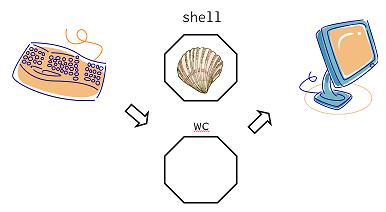

Here's what happens when we run `wc -l *.pdb > lengths`. The shell
starts by telling the computer to create a new process to run the `wc`
program. Since we've provided some filenames as arguments, `wc` reads
from them instead of from standard input. And since we've used `>` to
redirect output to a file, the shell connects the process's standard
output to that file ([Figure 16](#f:running_wc)):

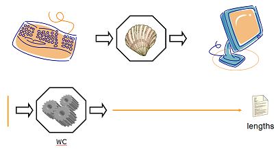

If we run `wc -l *.pdb | sort` instead, the shell creates two processes,
one for each component of the pipe, so that `wc` and `sort` run
simultaneously. The standard output of `wc` is fed directly to the
standard input of `sort`; since there's no redirection with `>`,
`sort`'s output goes to the screen ([Figure 17](#f:running_wc_sort)):

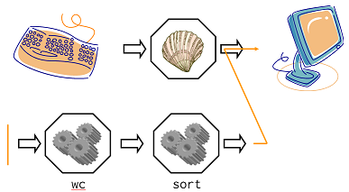

And if we run `wc -l *.pdb | sort | head -1`, we get the three processes
shown here, with data flowing from the files, through `wc` to `sort`,
and from `sort` through `head` to the screen ([Figure
18](#f:running_wc_sort_head)):

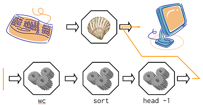

This programming model is called [pipes and
filters](glossary.html#pipe-and-filter). We've already seen pipes; a
[filter](glossary.html#filter) is a program that transforms a stream of
input into a stream of output. Almost all of the standard Unix tools can
work this way: unless told to do otherwise, they read from standard
input, do something with what they've read, and write to standard
output.

The key is that any program that reads lines of text from standard
input, and writes lines of text to standard output, can be combined with
every other program that behaves this way as well. You can *and should*
write your programs this way, so that you and other people can put those
programs into pipes to multiply their power.

### Redirecting Input

As well as using `>` to redirect a program's output, we can use `<` to
redirect its input, i.e., to read from a file instead of from standard
input. For example, instead of writing `wc ammonia.pdb`, we could write
`wc < ammonia.pdb`. In the first case, `wc` gets a command line argument
telling it what file to open. In the second, `wc` doesn't have any
command line arguments, so it reads from standard input, but we have
told the shell to send the contents of `ammonia.pdb` to `wc`'s standard
input.

### Nelle's Pipeline: Checking Files

Nelle has run her samples through the assay machines and created 1520
files in the `north-pacific-gyre/2012-07-03` directory described
earlier. As a quick sanity check, she types:

    $ cd north-pacific-gyre/2012-07-03
    $ wc -l *.txt

The output is 1520 lines that look like this:

     300 NENE01729A.txt
     300 NENE01729B.txt
     300 NENE01736A.txt
     300 NENE01751A.txt
     300 NENE01751B.txt
     300 NENE01812A.txt
     ... ...

Now she types this:

    $ wc -l *.txt | sort | head -5
     240 NENE02018B.txt
     300 NENE01729A.txt
     300 NENE01729B.txt
     300 NENE01736A.txt
     300 NENE01751A.txt

Whoops: one of the files is 60 lines shorter than the others. When she
goes back and checks it, she sees that she did that assay at 8:00 on a
Monday morning—someone was probably in using the machine on the weekend,
and she forgot to reset it. Before re-running that sample, she checks to
see if any files have too much data:

    $ wc -l *.txt | sort | tail -5
     300 NENE02040A.txt
     300 NENE02040B.txt
     300 NENE02040Z.txt
     300 NENE02043A.txt
     300 NENE02043B.txt

Those numbers look good—but what's that 'C' doing there in the
third-to-last line? All of her samples should be marked 'A' or 'B'; by
convention, her lab uses 'Z' to indicate samples with missing
information. To find others like it, she does this:

    $ ls *Z.txt
    NENE01971Z.txt    NENE02040Z.txt

Sure enough, when she checks the log on her laptop, there's no depth
recorded for either of those samples. Since it's too late to get the
information any other way, she must exclude those two files from her
analysis. She could just delete them using `rm`, but there are actually
some analyses she might do later where depth doesn't matter, so instead,
she'll just be careful later on to select files using the wildcard
expression `*[AB].txt`. As always, the '\*' matches any number of
characters; the new expression `[AB]` matches either an 'A' or a 'B', so
this matches all the valid data files she has.

### Summary

-   Use wildcards to match filenames.
-   '\*' is a wildcard pattern that matches zero or more characters in a
    pathname.
-   '?' is a wildcard pattern that matches any single character.
-   The shell matches wildcards before running commands.
-   `command > file` redirects a command's output to a file.
-   `first | second` is a pipeline: the output of the first command is
    used as the input to the second.
-   The best way to use the shell is to use pipes to combine simple
    single-purpose programs (filters).
-   `cat` displays the contents of its inputs.
-   `head` displays the first few lines of its input.
-   `sort` sorts its inputs.
-   `tail` displays the last few lines of its input.
-   `wc` counts lines, words, and characters in its inputs.

### Challenges

Suppose that `ls -F`{.in} initially displays:

    analyzed/  fructose.dat    raw/   sucrose.dat

1.  What is the difference between:

        wc -l < *.dat

    and:

        wc -l *.dat

    1.  Nothing: the two commands produce the same result.
    2.  There is no difference in output, but the first is more
        efficient than the second.
    3.  The first counts all lines together, while the second counts
        lines per file.
    4.  The first is an error, because there is no file whose name is
        literally `*.dat`.

2.  What single command must be used so that after it, `ls *`{.in} will
    display:

        analyzed:
        fructose.dat    sucrose.dat

        raw:

    1.  `cat *.dat > analyzed`{.in}
    2.  `mv *.dat analyzed`{.in}
    3.  `ls | analyzed`{.in}
    4.  None of the above.

3.  A file called `animals.txt` contains the following observations:

        2012-11-05,deer
        2012-11-05,rabbit
        2012-11-05,raccoon
        2012-11-06,rabbit
        2012-11-06,deer
        2012-11-06,fox
        2012-11-07,rabbit
        2012-11-07,bear

    The command:

        cut -d , -f 2 animals.txt

    produces the following output:

        deer
        rabbit
        raccoon
        rabbit
        deer
        fox
        rabbit
        bear

    What other command(s) could be added to this in a pipeline to find
    out how often each kind of animal had been seen?

    1.  cut -d , -f 2 animals.txt | count -c
    2.  cut -d , -f 2 animals.txt | sort | uniq
    3.  cut -d , -f 2 animals.txt | sort | uniq -c
    4.  cut -d , -f 2 animals.txt | uniq | sort | uniq

Loops
-----

### Learning Objectives:

-   Write a loop that applies one or more commands separately to each
    file in a set of files.
-   Trace the values taken on by a loop variable during execution of the
    loop.
-   Explain the difference between a variable's name and its value.
-   Explain why spaces and some punctuation characters shouldn't be used
    in files' names.
-   Demonstrate how to see what commands have recently been executed.
-   Re-run recently executed commands without retyping them.

Wildcards and tabs are one way to save on typing. Another, which is much
more powerful, is to tell the shell to do something over and over again.
Suppose we have several hundred genome data files in a directory with
names like `basilisk.dat`, `unicorn.dat`, and so on. Some new files have
just arrived, so we'd like to rename all the existing ones to
`original-basilisk.dat`, `original-unicorn.dat`, etc. We can't use:

    mv *.dat original-*.dat

because that would expand (in the two-file case) to:

    mv basilisk.dat unicorn.dat

(`original-*.dat` would expand to nothing, because there aren't any
files with names like that yet.) This wouldn't back up our files: it
would replace the content of `unicorn.dat` with whatever's in
`basilisk.dat`.

What we can do instead is use a [for loop](glossary.html#for-loop),
which does something *for* each thing in a list. Here's a simple
example:

    for filename in basilisk.dat unicorn.dat
    do
      head -3 $filename
    done

When the shell sees the keyword `for`, it knows it is supposed to repeat
a command (or group of commands) once for each thing in a list. In this
case, the list consists of the two data filenames. Each time through the
loop, the name of the file being processed is assigned to the variable
`filename`. Inside the loop, we get the variable's value by putting `$`
in front of it, so the first time through the loop, `$filename` is
`basilisk.dat`, and the second time, it is `unicorn.dat`. Finally, the
command that's actually being run is our old friend `head`, so this loop
prints out the first three lines of each data file in turn.

### What's In a Name?

We have called the variable in this loop `filename` in order to make its
purpose clearer to human readers. The shell itself doesn't care what the
variable is called; if we wrote this loop as:

    for x in basilisk.dat unicorn.dat
    do
      head -3 $x
    done

or:

    for temperature in basilisk.dat unicorn.dat
    do
      head -3 $temperature
    done

it would work exactly the same way. *Don't do this.* Programs are only
useful if people can understand them, so using meaningless names (like
`x`) or misleading names (like `temperature`) increases the likelihood
of the program being wrong.

Here's a slightly more complicated loop:

    for filename in *.dat
    do
      echo $filename
      head -100 $filename | tail -20
    done

The shell starts by expanding `*.dat` to create the list of files it
will process. The [loop body](glossary.html#loop-body) then executes two
commands for each of those files. The first, `echo`, just prints its
command-line arguments to standard output. For example:

    echo hello there

prints:

    hello there

In this case, since the shell expands `$filename` to be the name of a
file, `echo $filename` just prints the name of the file. Note that we
can't write this as:

    for filename in *.dat
    do
      $filename
      head -100 $filename | tail -20
    done

because then the first time through the loop, when `$filename` expanded
to `basilisk.dat`, the shell would try to run `basilisk.dat` as a
program. Finally, the `head` and `tail` combination selects lines 80-100
from whatever file is being processed.

### Spaces in Names

Filename expansion in loops is one reason why you should *not* use
spaces in filenames. Suppose our data files are named:

    basilisk.dat
    red dragon.dat
    unicorn.dat

If we try to process them using:

    for filename in *.dat
    do
      echo $filename
      head -100 $filename | tail -20
    done

then `*.dat` will expand to:

    basilisk.dat red dragon.dat unicorn.dat

which means that `filename` will be assigned each of the following
values in turn:

    basilisk.dat
    red
    dragon.dat
    unicorn.dat

The highlighted lands show the problem: instead of getting one name
`red dragon.dat`, the commands in the loop will get `red` and
`dragon.dat` separately. To make matters worse, the file
`red dragon.dat` won't be processed at all. There are ways to get around
this, but the safest thing is to use dashes, underscores, or some other
printable character instead.

Going back to our original file renaming problem, we can solve it using
this loop:

    for filename in *.dat
    do
      mv $filename original-$filename
    done

This loop runs the `mv` command once for each filename. The first time,
when `$filename` expands to `basilisk.dat`, the shell executes:

    mv basilisk.dat original-basilisk.dat

The second time, the command is:

    mv unicorn.dat original-unicorn.dat

### Measure Twice, Run Once

A loop is a way to do many things at once—or to make many mistakes at
once if it does the wrong thing. One way to check what a loop *would* do
is to echo the commands it would run instead of actually running them.
For example, we could write our file renaming loop like this:

    for filename in *.dat
    do
      echo mv $filename original-$filename
    done

Instead of running `mv`, this loop runs `echo`, which prints out:

    mv basilisk.dat original-basilisk.dat
    mv unicorn.dat original-unicorn.dat

*without* actually running those commands. We can then use up-arrow to
redisplay the loop, back-arrow to get to the word `echo`, delete it, and
then press "enter" to run the loop with the actual `mv` commands. This
isn't foolproof, but it's a handy way to see what's going to happen when
you're still learning how loops work.

### Nelle's Pipeline: Processing Files

Nelle is now ready to process her data files. Since she's still learning
how to use the shell, she decides to build up the required commands in
stages. Her first step is to make sure that she can select the right
files—remember, these are ones whose names end in 'A' or 'B', rather
than 'Z':

    $ cd north-pacific-gyre/2012-07-03
    $ for datafile in *[AB].txt
    do
      echo $datafile
    done
    NENE01729A.txt
    NENE01729B.txt
    NENE01736A.txt
    ...
    NENE02043A.txt
    NENE02043B.txt
    $

Her next step is to figure out what to call the files that the `goostat`
analysis program will create. Prefixing each input file's name with
"stats" seems simple, so she modifies her loop to do that:

    $ for datafile in *[AB].txt
    do
      echo $datafile stats-$datafile
    done
    NENE01729A.txt stats-NENE01729A.txt
    NENE01729B.txt stats-NENE01729B.txt
    NENE01736A.txt stats-NENE01736A.txt
    ...
    NENE02043A.txt stats-NENE02043A.txt
    NENE02043B.txt stats-NENE02043B.txt
    $

She hasn't actually run `goostats` yet, but now she's sure she can
select the right files and generate the right output filenames.

Typing in commands over and over again is becoming tedious, though, and
Nelle is worried about making mistakes, so instead of re-entering her
loop, she presses the up arrow. In response, Bash redisplays the whole
loop on one line (using semi-colons to separate the pieces):

    $ for datafile in *[AB].txt; do echo $datafile stats-$datafile; done

Using the left arrow key, Nelle backs up and changes the command `echo`
to `goostats`:

    $ for datafile in *[AB].txt; do goostats $datafile stats-$datafile; done

When she presses enter, Bash runs the modified command. However, nothing
appears to happen—there is no output. After a moment, Nelle realizes
that since her script doesn't print anything to the screen any longer,
she has no idea whether it is running, much less how quickly. She kills
the job by typing Control-C, uses up-arrow to repeat the command, and
edits it to read:

    $ for datafile in *[AB].txt; do echo $datafile; goostats $datafile stats-$datafile; done

When she runs her program now, it produces one line of output every five
seconds or so:

    NENE01729A.txt
    NENE01729B.txt
    NENE01736A.txt
    ...
    $

1518 times 5 seconds, divided by 60, tells her that her script will take
about two hours to run. As a final check, she opens another terminal
window, goes into `north-pacific-gyre/2012-07-03`, and uses
`cat NENE01729B.txt` to examine one of the output files. It looks good,
so she decides to get some coffee and catch up on her reading.

### Those Who Know History Can Choose to Repeat It

Another way to repeat previous work is to use the `history` command to
get a list of the last few hundred commands that have been executed, and
then to use `!123` (where "123" is replaced by the command number) to
repeat one of those commands. For example, if Nelle types this:

    $ $ history | tail -5
      456  ls -l NENE0*.txt
      457  rm stats-NENE01729B.txt.txt
      458  goostats NENE01729B.txt stats-NENE01729B.txt
      459  ls -l NENE0*.txt
      460  history

then she can re-run `goostats` on `NENE01729B.txt` simply by typing
`!458`.

### Summary

-   Use a `for` loop to repeat commands once for every thing in a list.
-   Every `for` loop needs a variable to refer to the current "thing".
-   Use `$name` to expand a variable (i.e., get its value).
-   Do not use spaces, quotes, or wildcard characters such as '\*' or
    '?' in filenames, as it complicates variable expansion.
-   Give files consistent names that are easy to match with wildcard
    patterns to make it easy to select them for looping.
-   Use the up-arrow key to scroll up through previous commands to edit
    and repeat them.
-   Use `history` to display recent commands, and `!number` to repeat a
    command by number.
-   Use \^C (control-C) to terminate a running command.

### Challenges

Suppose that `ls`{.in} initially displays:

    fructose.dat    glucose.dat   sucrose.dat

1.  What is the output of:

        for datafile in *.dat
        do
            ls *.dat
        done

    1.

    2.

    3.

    4.

        fructose.dat
        glucose.dat
        sucrose.dat

        fructose.dat
        fructose.dat
        fructose.dat

        fructose.dat glucose.dat sucrose.dat
        fructose.dat glucose.dat sucrose.dat
        fructose.dat glucose.dat sucrose.dat

    None of the above.

2.  The `expr` does simple arithmetic using command-line arguments:

        $ expr 3 + 5
        8
        $ expr 30 / 5 - 2
        4

    Given this, what is the output of:

        for left in 2 3
        do
          for right in $left
          do
            expr $left + $right
          done
        done

    1.

    2.

    3.

    4.

        4
        5
        5
        6

        4
        6

        left
        left right

    An error.

3.  In a directory with the same three sugar file names, what does this
    command do?

        for sugar in *.dat
        do
          echo $sugar
          cat $sugar > xylose.dat
        done

    1.  Prints `fructose.dat`, `glucose.dat`, and `sucrose.dat`, and
        copies `sucrose.dat` to create `xylose.dat`.
    2.  Prints `fructose.dat`, `glucose.dat`, and `sucrose.dat`, and
        concatenates all three files to create `xylose.dat`.
    3.  Prints `fructose.dat`, `glucose.dat`, `sucrose.dat`, and
        `xylose.dat`, and copies `sucrose.dat` to create `xylose.dat`.
    4.  None of the above.

Shell Scripts
-------------

### Learning Objectives:

-   Write a shell script that runs a command or series of commands for a
    fixed set of files.
-   Run a shell script from the command line.
-   Write a shell script that operates on a set of files defined by the
    user on the command line.
-   Create pipelines that include user-written shell scripts.

We can now start creating "programs" using nothing but shell commands.
Let's start by putting the following line in the file `smallest`:

    wc -l *.pdb | sort -n

This is a variation on the pipe we constructed [earlier](#s:pipefilter):
it displays all of the files sorted by the number of lines (the `-n`
flag to `sort` means "sort numerically"). Remember, we are *not* running
it as a command just yet: we are putting the commands in a file. Once
we're done, let's ask the shell (which is called `bash`) to run those
saved commands:

    $ bash smallest
      9  methane.pdb
     12  ethane.pdb
     15  propane.pdb
     20  cubane.pdb
     21  pentane.pdb
     30  octane.pdb
    107  total

Sure enough, our little program's output is exactly what we'd get if we
ran that pipeline ourselves.

We can make this script a little more flexible by changing `*.pdb` to
`$*`, a shortcut which means "all of the command-line arguments". The
new `smallest` looks like this:

    $ cat smallest
    wc -l $* | sort -n
    $

Once we have done this, we can use our program—usually called a [shell
script](glossary.html#shell-script)—to sort any set of files by size:

    $ bash smallest *.txt
    419  paper.txt
    2718 thesis.txt
    $

### Why Isn't It Doing Anything?

What happens if a script is supposed to process a bunch of files, but we
don't give it any filenames? For example, what if we type:

    $ bash smallest

but don't say `*.txt` (or anything else)? In this case, `$*` expands to
nothing at all, so the pipeline inside the script is effectively:

    wc -l | sort -n

Since it doesn't have any filenames, `wc` assumes it is supposed to
process standard input, so it just sits there and waits for us to give
it some data interactively. From the outside, though, all we see is it
sitting there: the script doesn't appear to do anything.

This is not a bug: it's actually very useful, because it lets us use our
scripts as components in pipelines in their own right. For example, we
can do this:

    $ cat sugar/*.pdb | bash smallest

to concatenate all the molecule data in the `sugar` directory into a
single stream, and run it through `smallest` in one step. The results
aren't particularly useful in this case, but stepping back, the fact
that we can combine the tools we build to create larger tools, which can
in turn be combined to create even larger tools, is possibly the single
most powerful idea in programming.

If we want, we can use `$1`, `$2`, and so on to select particular
arguments instead of always running on all the arguments. Together,
these facilities let us write some very complicated programs using only
the commands we would type interactively.

In practice, most people develop shell scripts by running commands at
the shell prompt a few times to make sure they are doing what we want,
then copying them into a file so that we can re-use them in a single
step. If we follow the Unix convention of reading data from standard
input when we're not given filenames, and writing results to standard
output, we can combine those programs with others using pipes and
redirection to create even more powerful programs. Trying doing *that*
with a bunch of GUIs…

### Text vs. Whatever

We usually call programs like Microsoft Word or LibreOffice Writer "text
editors", but we need to be a bit more careful when it comes to
programming. By default, Microsoft Word uses `.doc` files to store not
only text, but also formatting information about fonts, headings, and so
on. This extra information isn't stored as characters, and doesn't mean
anything to the Python interpreter: it expects input files to contain
nothing but the letters, digits, and punctuation on a standard computer
keyboard. When editing programs, therefore, you must either use a plain
text editor, or be careful to save files as plain text.

### Nelle's Pipeline: Creating a Script

An off-hand comment from her supervisor has made Nelle realize that she
should have provided a couple of extra parameters to `goostats` when she
processed her files. This might have been a disaster if she had done all
the analysis by hand, but thanks to for loops, it will only take a
couple of hours to re-do.

Experience has taught her, though, that if something needs to be done
twice, it will probably need to be done a third or fourth time as well.
She runs the editor and writes the following:

    for datafile in $*
    do
        echo $datafile
        goostats -J 100 -r $datafile stats-$datafile
    done

(The parameters `-J 100` and `-r` are the ones her supervisor said she
should have used.) She saves this in a file called `do-stats.sh`, so
that she can now re-do the first stage of her analysis by typing:

    $ bash do-stats.sh *[AB].txt

She can also do this:

    $ bash do-stats.sh *[AB].txt | wc -l

so that the output is just the number of files processed, rather than
the names of the files that were processed.

One thing to note about Nelle's script is her choice to let the person
running it decide what files to process. She could have written the
script as:

    for datafile in *[AB].txt
    do
        echo $datafile
        goostats -J 100 -r $datafile stats-$datafile
    done

The advantage is that this always selects the right files: she doesn't
have to remember to exclude the 'Z' files. The disadvantage is that it
*always* selects just those files—she can't run it on all files
(including the 'Z' files), or on the 'G' or 'H' files her colleagues in
Antarctica are producing, without editing the script. If she wanted to
be more adventurous, she could modify her script to check for
command-line arguments, and use `*[AB].txt` if none were provided. Of
course, this introduces another tradeoff between flexibility and
complexity; we'll explore this [later](quality.html).

### Summary

-   Save commands in files (usually called shell scripts) for re-use.
-   Use `bash filename` to run saved commands.
-   `$*` refers to all of a shell script's command-line arguments.
-   `$1`, `$2`, etc., refer to specified command-line arguments.
-   Letting users decide what files to process is more flexible and more
    consistent with built-in Unix commands.

### Challenges

1.  Suppose that `ls`{.in} displays:

        display.sh    fructose.dat    glucose.dat   sucrose.dat

    What must `display.sh` contain in order for:

        $ bash display.sh *.dat

    to display each sugar data file exactly once (and nothing else)?

    1.

    2.

    3.

    4.

        echo *.*

        for filename in $1 $2 $3
        do
          cat $filename
        done

        echo $*.dat

    None of the above.

2.  Nelle wants to save the last five commands she ran as a shell script
    to re-use later. She runs:

        $ history | tail -5 > redo-last-5.sh

    To test it out, she then runs:

        $ bash redo-last-5.sh

    What happens?

    1.  The five commands she wanted to re-run are re-run.
    2.  Only the last *four* commands are re-run, because the command
        `history` is also saved in `redo-last-5.sh`.
    3.  No commands are re-run, because `redo-last-5.sh` also contains
        the serial numbers of commands (which aren't legally commands
        themselves).
    4.  Each time she runs this, the most recent five commands are
        replayed (whether they're the five she originally wanted to save
        or not).

Finding Things
--------------

### Learning Objectives:

-   Use `grep` to select lines from text files that match simple
    patterns.
-   Use `find` to find files whose names match simple patterns.
-   Use the output of one command as the command-line arguments to
    another command.
-   Explain what is meant by "text" and "binary" files, and why many
    common tools don't handle the latter well.

You can often guess someone's age by listening to how people talk about
search. Just as young people use "Google" as a verb, crusty old Unix
programmers use "grep". The word is a contraction of "global/regular
expression/print", a common sequence of operations in early Unix text
editors. It is also the name of a very useful command-line program.

`grep` finds and prints lines in files that match a pattern. For our
examples, we will use a file that contains three haikus taken from a
[1998 competition in Salon
magazine](http://www.salonmagazine.com/21st/chal/1998/01/26chal.html):

    The Tao that is seen
    Is not the true Tao, until
    You bring fresh toner.

    With searching comes loss
    and the presence of absence:
    "My Thesis" not found.

    Yesterday it worked
    Today it is not working
    Software is like that.

Let's find lines that contain the word "not":

    $ grep not haiku.txt
    Is not the true Tao, until
    "My Thesis" not found
    Today it is not working
    $

Here, `not` is the pattern we're searching for. It's pretty simple:
every alphanumeric character matches against itself. After the pattern
comes the name or names of the files we're searching in. The output is
the three lines in the file that contain the letters "not".

Let's try a different pattern: "day".

    $ grep day haiku.txt
    Yesterday it worked
    Today it is not working
    $

This time, the output is lines containing the words "Yesterday" and
"Today", which both have the letters "day". If we give `grep` the `-w`
flag, it restricts matches to word boundaries, so that only lines with
the word "day" will be printed:

    $ grep -w day haiku.txt
    $

In this case, there aren't any, so `grep`'s output is empty.

Another useful option is `-n`, which numbers the lines that match:

    $ grep -n it haiku.txt
    5:With searching comes loss
    9:Yesterday it worked
    10:Today it is not working
    $

Here, we can see that lines 5, 9, and 10 contain the letters "it".

As with other Unix commands, we can combine flags. For example, since
`-i` makes matching case-insensitive, and `-v` inverts the match, using
them both only prints lines that *don't* match the pattern in any mix of
upper and lower case:

    $ grep -i -v the haiku.txt
    You bring fresh toner.

    With searching comes loss

    Yesterday it worked
    Today it is not working
    Software is like that.
    $

`grep` has lots of other options. To find out what they are, we can type
`man grep`. `man` is the Unix "manual" command. It prints a description
of a command and its options, and (if you're lucky) provides a few
examples of how to use it:

    $ man grep
    GREP(1)                                                                                              GREP(1)

    NAME
           grep, egrep, fgrep - print lines matching a pattern

    SYNOPSIS
           grep [OPTIONS] PATTERN [FILE...]
           grep [OPTIONS] [-e PATTERN | -f FILE] [FILE...]

    DESCRIPTION
           grep  searches the named input FILEs (or standard input if no files are named, or if a single hyphen-
           minus (-) is given as file name) for lines containing a match to the given PATTERN.  By default, grep
           prints the matching lines.
           …        …        …

    OPTIONS
       Generic Program Information
           --help Print  a  usage  message  briefly summarizing these command-line options and the bug-reporting
                  address, then exit.

           -V, --version
                  Print the version number of grep to the standard output stream.  This version number should be
                  included in all bug reports (see below).

       Matcher Selection
           -E, --extended-regexp
                  Interpret  PATTERN  as  an  extended regular expression (ERE, see below).  (-E is specified by
                  POSIX.)

           -F, --fixed-strings
                  Interpret PATTERN as a list of fixed strings, separated by newlines, any of  which  is  to  be
                  matched.  (-F is specified by POSIX.)
        …        …        …

### Wildcards

`grep`'s real power doesn't come from its options, though; it comes from
the fact that patterns can include wildcards. (The technical name for
these is [regular expressions](glossary.html#regular-expression), which
is what the "re" in "grep" stands for.) Regular expressions are complex
enough that we devotedan entire section of the website to them; if you
want to do complex searches, please check it out. As a taster, we can
find lines that have an 'o' in the second position like this:

    $ grep -E '^.o' haiku.txt
    You bring fresh toner.
    Today it is not working
    Software is like that.

We use the `-E` flag and put the pattern in quotes to prevent the shell
from trying to interpret it. (If the pattern contained a '\*', for
example, the shell would try to expand it before running `grep`.) The
'\^' in the pattern anchors the match to the start of the line. The '.'
matches a single character (just like '?' in the shell), while the 'o'
matches an actual 'o'.

While `grep` finds lines in files, the `find` command finds files
themselves. Again, it has a lot of options; to show how the simplest
ones work, we'll use the directory tree in [Figure
24](#f:find_file_tree):

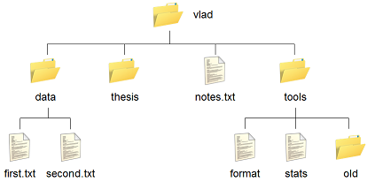

Vlad's home directory contains one file called `notes.txt` and four
subdirectories: `thesis` (which is sadly empty), `data` (which contains
two files `first.txt` and `second.txt`), a `tools` directory that
contains the programs `format` and `stats`, and an empty subdirectory
called `old`.

For our first command, let's run `find . -type d`. `.` is the directory
where we want our search to start; `-type d` means "things that are
directories". Sure enough, `find`'s output is the names of the five
directories in our little tree (including `.`, the current working
directory):

    $ find . -type d
    ./
    ./data
    ./thesis
    ./tools
    ./tools/old
    $

If we change `-type d` to `-type f`, we get a listing of all the files
instead:

    $ find . -type f
    ./data/first.txt
    ./data/second.txt
    ./notes.txt
    ./tools/format
    ./tools/stats
    $

`find` automatically goes into subdirectories, their subdirectories, and
so on to find everything that matches the pattern we've given it. If we
don't want it to, we can use `-maxdepth` to restrict the depth of
search:

    $ find . -maxdepth 1 -type f
    ./notes.txt
    $

The opposite of `-maxdepth` is `-mindepth`, which tells `find` to only
report things that are at or below a certain depth. `-mindepth 2`
therefore finds all the files that are two or more levels below us:

    $ find . -mindepth 2 -type f
    ./data/first.txt
    ./data/second.txt
    ./tools/format
    ./tools/stats
    $

Another option is `-empty`. It restricts matches to empty files and
directories, of which we have two:

    $ find . -empty
    ./thesis
    ./tools/old
    $

Let's try matching by name:

    $ find . -name *.txt
    ./notes.txt
    $

We expected it to find all the text files, but it only prints out
`./notes.txt`: what's gone wrong?

The problem is that the shell expands wildcard characters like `*`
*before* commands run. Since `*.txt` in the current directory expands to
`notes.txt`, the command we actually ran was:

    $ find . -name notes.txt

`find` did what we asked; we just asked for the wrong thing.

To get what we want, let's do what we did with `grep`: put `*.txt` in
single quotes to prevent the shell from expanding the `*` wildcard. This
way, `find` actually gets the pattern `*.txt`, not the expanded filename
`notes.txt`:

    $ find . -name '*.txt'
    ./data/first.txt
    ./data/second.txt
    ./notes.txt
    $

As we said [earlier](#s:pipefilter), the command line's power lies in
combining tools. We've seen how to do that with pipes; let's look at
another technique. As we just saw, `find . -name '*.txt'` gives us a
list of all text files in or below the current directory. How can we
combine that with `wc -l` to count the lines in all those files?

One way is to put the `find` command inside `$()`:

    $ wc -l $(find . -name '*.txt')
      70  ./data/first.txt
     420  ./data/second.txt
      30  ./notes.txt
     520  total
    $

When the shell executes this command, the first thing it does is run
whatever is inside the `$()`. It then replaces the `$()` expression with
that command's output. Since the output of `find` is the three filenames
`./data/first.txt`, `./data/second.txt`, and `./notes.txt`, the shell
constructs the command:

    $ wc -l ./data/first.txt ./data/second.txt ./notes.txt

which is what we wanted. This expansion is exactly what the shell does
when it expands wildcards like `*` and `?`, but lets us use any command
we want as our own "wildcard".

It's very common to use `find` and `grep` together. The first finds
files that match a pattern; the second looks for lines inside those
files that match another pattern. Here, for example, we can find PDB
files that contain iron atoms by looking for the string "FE" in all the
`.pdb` files below the current directory:

    $ grep FE $(find . -name '*.pdb')
    ./human/heme.pdb:ATOM  25  FE  1  -0.924  0.535  -0.518
    $

### Binary Files

We have focused exclusively on finding things in text files. What if
your data is stored as images, in databases, or in some other format?
One option would be to extend tools like `grep` to handle those formats.
This hasn't happened, and probably won't, because there are too many
formats to support.

The second option is to convert the data to text, or extract the
text-ish bits from the data. This is probably the most common approach,
since it only requires people to build one tool per data format (to
extract information). On the one hand, it makes simple things easy to
do. On the negative side, complex things are usually impossible. For
example, it's easy enough to write a program that will extract X and Y
dimensions from image files for `grep` to play with, but how would you
write something to find values in a spreadsheet whose cells contained
formulas?

The third choice is to recognize that the shell and text processing have
their limits, and to use a programming language such as Python instead.
When the time comes to do this, don't be too hard on the shell: many
modern programming languages, Python included, have borrowed a lot of
ideas from it, and imitation is also the sincerest form of praise.

### Nelle's Pipeline: The Second Stage

Nelle now has a directory called `north-pacific-gyre/2012-07-03`
containing 1518 data files, and needs to compare each one against all of
the others to find the hundred pairs with the highest pairwise scores.
Armed with what she has learned so far, she writes the following script

    for left in $*
    do
        for right in $*
        do
            echo $left $right $(goodiff $left $right)
        done
    done

The outermost loop assigns the name of each file to the variable `left`
in turn. The inner loop does the same thing for the variable `right`
each time the outer loop executes, so inside the inner loop, `left` and
`right` are given each pair of filenames ([Figure 25](#f:nested_loops)).

Each time it runs the command inside the inner loop, the shell starts by
running `goodiff` on the two files in order to expand the `$()`
expression. Once it's done that, it passes the output, along with the
names of the files, to `echo`. Thus, if Nelle saves this script as
`pairwise.sh` and runs it as:

    $ bash pairwise.sh stats-*.txt

the shell runs:

    echo stats-NENE01729A.txt stats-NENE01729A.txt $(goodiff stats-NENE01729A.txt stats-NENE01729A.txt)
    echo stats-NENE01729A.txt stats-NENE01729B.txt $(goodiff stats-NENE01729A.txt stats-NENE01729B.txt)
    echo stats-NENE01729A.txt stats-NENE01736A.txt $(goodiff stats-NENE01729A.txt stats-NENE01736A.txt)
    ...

which turns into:

    echo stats-NENE01729A.txt stats-NENE01729A.txt files are identical
    echo stats-NENE01729A.txt stats-NENE01729B.txt 0.97182
    echo stats-NENE01729A.txt stats-NENE01736A.txt 0.45223
    ...

which in turn prints:

    stats-NENE01729A.txt stats-NENE01729A.txt files are identical
    stats-NENE01729A.txt stats-NENE01729B.txt 0.97182
    stats-NENE01729A.txt stats-NENE01736A.txt 0.45223
    ...

That's a good start, but Nelle can do better. First, she notices that
when the two input files are the same, the output is the words "files
are identical" instead of a numerical score. She can remove these lines
like this:

    $ bash pairwise.sh stats-*.txt | grep -v 'files are identical'

or put the call to `grep` inside the shell script (which will be less
error-prone):

    for left in $*
    do
        for right in $*
        do
            echo $left $right $(goodiff $left $right)
        done
    done | grep -v 'files are identical'

This works because `do`…`done` counts as a single command in Bash. If
Nelle wanted to make this clearer, she could put parentheses around the
loop:

    (for left in $*
    do
        for right in $*
        do
            echo $left $right $(goodiff $left $right)
        done
    done) | grep -v 'files are identical'

or move the `grep` to a line of its own:

    for left in $*
    do
        for right in $*
        do
            echo $left $right $(goodiff $left $right)
        done
    done \
    | grep -v 'files are identical'

The backslash tells the shell that the line doesn't really end after the
outer `done`. Without it, the shell would see two commands: the outer
loop (which would print to standard output), and then a call to `grep`
without any filenames (which would wait forever waiting for the user to
type something at the keyboard).

The last thing Nelle needs to do before writing up is find the 100 best
pairwise matches. She has seen this before: sort the lines numerically,
then use `head` to select the top lines. However, the numbers she wants
to sort by are at the end of the line, rather than beginning. Reading
the output of `man sort` tells her that the `-k` flag will let her
specify which column of input she wants to use as a sort key, but the
syntax looks a little complicated. Instead, she moves the score to the
front of each line:

    for left in $*
    do
        for right in $*
        do
            echo $(goodiff $left $right) $left $right
        done
    done \
    | grep -v 'files are identical'

and then adds two more commands to the pipeline:

    for left in $*
    do
        for right in $*
        do
            echo $(goodiff $left $right) $left $right
        done
    done \
    | grep -v 'files are identical' \
    | sort -n -r
    | head -100

She then runs:

    $ bash pairwise.sh stats-*.txt > top100.txt

and heads off to a seminar, confident that by the time she comes back
tomorrow, `top100.txt` will contain the results she needs for her paper.

### Summary

-   Everything is stored as bytes, but the bytes in binary files do not
    represent characters.
-   Use nested loops to run commands for every combination of two lists
    of things.
-   Use '\\' to break one logical line into several physical lines.
-   Use parentheses '()' to keep things combined.
-   Use `$(command)` to insert a command's output in place.
-   `find` finds files with specific properties that match patterns.
-   `grep` selects lines in files that match patterns.
-   `man command` displays the manual page for a given command.

1.  Which description most accurately explains what the following
    pipeline does?

        find . -name '*.dat' -print | wc -l | sort -n

    1.  Display the number of lines in each data file in or below the
        current directory, ordered numerically from longest to shortest.
    2.  Display a single line showing the total number of lines in all
        data files in or below the current directory.
    3.  Display the number of data files in order below the current
        directory.
    4.  None of the above.

2.  The `-v` flag to `grep` inverts pattern matching, so that only lines
    which do *not* match the pattern are printed. Given that, which of
    the following commands will find all files in `/data` whose names
    end in `ose.dat` (e.g., `sucrose.dat` or `maltose.dat`), but do
    *not* contain the word `temp`?

    1.

    2.

    3.

    4.

        find /data -name '*.dat' -print | grep ose | grep -v temp

        find /data -name ose.dat -print | grep -v temp

        grep -v temp $(find /data -name '*ose.dat' -print)

    None of the above.

3.  Nelle has saved the IDs of some suspicious observations in a file
    called `maybe-faked.txt`:

        NENE01909C
        NEMA04220A
        NEMA04301A

    Which of the following scripts will search all of the `.txt` files
    whose names begin with `NE` for references of these records?

    1.

    2.

    3.

    4.

        for pat in maybe-faked.txt
        do
            find . -name 'NE*.txt' -print | grep $pat
        done

        for pat in $(cat maybe-faked.txt)
        do
            grep $pat $(find . -name 'NE*.txt' -print)
        done

        for pat in $(cat maybe-faked.txt)
        do
            find . -name 'NE*.txt' -print | grep $pat
        done

    None of the above.

Summing Up
----------

The Unix shell is older than most of the people who use it. It has
survived so long because it is one of the most productive programming
environments ever created—maybe even *the* most productive. Its syntax
may be cryptic, but as Nelle's story shows, people who have mastered it
can experiment with different commands interactively, then use what they
have learned to automate their work. Here's how it relates to the
questions that motivate Software Carpentry:
